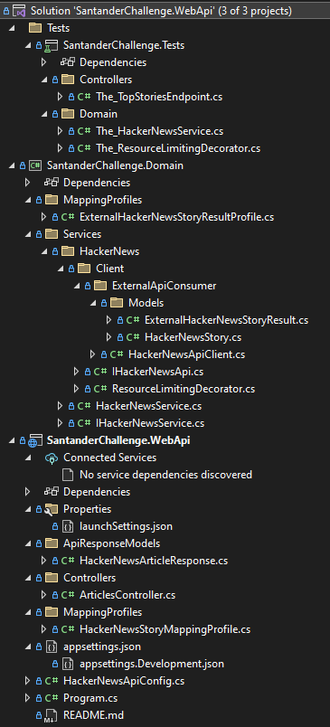

# Developer Coding Test

My name is Pete Celliers. This is my WebApi implementation (using .Net) for the n best stories retrieval of Hacker News via their API.
You can also [Download the requirement](./.ReadmeAssets/requirement.pdf)  / [Download my CV](./.ReadmeAssets/CV.pdf)

## Solution structure

The solution is structured as follow: (Tests, Domain & WebApi)



## Getting Started

Clone this repository:

```
git clone https://github.com/snarfy/DeveloperCodingTest.git
```

Navigate to the project directory:

```
cd DeveloperCodingTest
cd SantanderChallenge.WebApi
```
Build and run the project:

```
dotnet run
```

The API should be available at  [`http://localhost:5000/articles/top-stories/15`](http://localhost:5000/articles/top-stories/15)

*(If not, follow the troubleshooting guide below)*

## Troubleshooting
This could potentially be on a different port on your machine
If that's the case, then see the output from dotnet run, e.g.*
```
$ dotnet run
Building...
info: Microsoft.Hosting.Lifetime[14]
      Now listening on: http://localhost:9999
```

## API Endpoints

### Retrieve n Best HackerNews Stories

- **Endpoint:** `/articles/top-stories/{count:int}`
- **Method:** GET
- **Description:** Retrieves the details of the n best stories from the Hacker News API.
- **Parameters:** `count` - The max number of stories to retrieve.
- **Example:** `/articles/top-stories/5`


## Swagger Documentation

You can access Swagger documentation for the API at  [`http://localhost:5000/swagger`](http://localhost:5000/swagger) when running the project in development mode.

## Testing

The project includes unit tests and integration tests using xUnit and FakeItEasy. You can run tests using the following command from the root folder:
```
dotnet test
```


## Assumptions

I have taken the liberty of setting the max concurrent HTTP call limit for HackerNews article details to 10. 
This can be changed in the code (Program.cs, line 17) by setting e.g. MaxConcurrentArticleFetching = 30

## Future Enhancements

### Split caching out of ResourceLimitingDecorator
Currently ResourceLimitingDecorator has 2 responsibilities, namely caching and limiting the outgoing HTTP requests. Ideally this should be split into 2 separate decorators but given my time constraints I have left it as is. 

### Rate limit outgoing http requests
We do limit concurrent outgoing http requests in config (currently set to 10 concurrent http requests max).
But we could also rate limit outgoing http requests to ensure we don't exceed certain limits as set out by 3rd parties. (e.g. 100 requests per minute)

### Introduce a .json config file
Currently we handle configuration programatically as follows:
```
var config = new HackerNewsApiConfig
    {
        MaxConcurrentArticleFetching = 3 // Config
    };
```
Ideally we should introduce a config.json file and read config dynamically from there. 

### Invalidate article cache after a TTL
Currently we don't invalidate HackerNews article caching (since it remains relatively consistent over a short period of time - just comment count might vary slightly). Ideally, we should invalidate this cache after a certain TTL. I have illustrated how to do so while fetching the TopStoryIdList and hoped it suffice given my time constraints. It could be applied to articles in a similar fashion.

### Persist article cache to some form of storage (Disk/Database)
By storing article cache to storage, we can remove state from the decorator making it scalable to a web-farm. 
Also, there are only 200 top articles max on HackerNews, but if there were much more, it's better to store to disk/db than keeping it in-memory.

### Upgrade to .Net 8
We should upgrade the entire solution to .Net 8 which was released yesterday (at the time of writing this) November 14, 2023.
